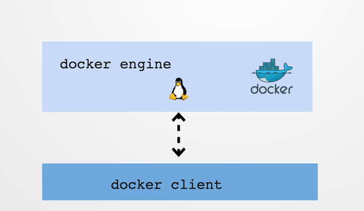

Docker engine and daemon are the names used interchangeably. 
It refers to the same entity.

If you look at the above diagram there are two entities here

    Docker Client : This is the utility we use when we run any docker commands e.g. docker run (docker container run) , docker images , docker ps etc. It allows us to run these commands which a human can easily understand.
    Docker Daemon/Engine: This is the part which does rest of the magic and knows how to talk to the kernel, makes the system calls to create, operate and manage containers, which we as users of docker dont have to worry about.

Communication between docker client and docker engine happens over REST api. Docker engine runs on port 2376 by default.

Source:https://www.quora.com/What-is-the-difference-between-the-Docker-Engine-and-Docker-Daemon